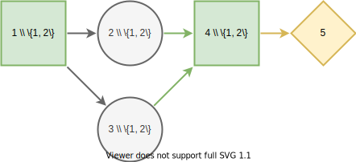

# DecisionProgramming.jl
[](https://gamma-opt.github.io/DecisionProgramming.jl/dev/)

[](https://zenodo.org/badge/latestdoi/269314037)

## Description
`DecisionProgramming.jl` is a [Julia](https://julialang.org/) package for solving multi-stage decision problems under uncertainty, modeled using influence diagrams. Internally, it relies on mathematical optimization. Decision models can be embedded within other optimization models. We designed the package as [JuMP](https://jump.dev/) extension. We have also developed a [Python](https://python.org) interface, which is available [here](https://github.com/gamma-opt/pyDecisionProgramming). 

## Citing
The Decision Programming framework is described in this publication. If you found the framework useful in your work, we kindly ask you to cite the following publication ([pdf](https://www.sciencedirect.com/science/article/pii/S0377221721010201/pdf)):
```
@article{Salo_et_al-2022,
    title = {Decision programming for mixed-integer multi-stage optimization under uncertainty},
    journal = {European Journal of Operational Research},
    volume = {299},
    number = {2},
    pages = {550-565},
    year = {2022},
    issn = {0377-2217},
    doi = {https://doi.org/10.1016/j.ejor.2021.12.013},
    url = {https://www.sciencedirect.com/science/article/pii/S0377221721010201},
    author = {Ahti Salo and Juho Andelmin and Fabricio Oliveira},
    keywords = {Decision analysis, Influence diagrams, Decision trees, Contingent portfolio programming, Stochastic programming}
}
```

## Syntax


We can create an influence diagram as follows:

```julia
using DecisionProgramming

diagram = InfluenceDiagram()

add_node!(diagram, DecisionNode("A", [], ["a", "b"]))
add_node!(diagram, ChanceNode("B", ["A"], ["x", "y"]))
add_node!(diagram, ChanceNode("C", ["A"], ["v", "w"]))
add_node!(diagram, DecisionNode("D", ["B", "C"], ["k", "l"]))
add_node!(diagram, ValueNode("V", ["D"]))

generate_arcs!(diagram)

add_probabilities!(diagram, "B", [0.4 0.6; 0.6 0.4])
add_probabilities!(diagram, "C", [0.7 0.3; 0.3 0.7])
add_utilities!(diagram, "V", [1.5, 1.7])
```

Using the influence diagram, we generate the model as follows:

```julia
using JuMP
model, z, variables = generate_model(diagram, model_type="RJT")
```

We can optimize the model using MILP solver.

```julia
using HiGHS
optimizer = optimizer_with_attributes(
    () -> HiGHS.Optimizer()
)
set_optimizer(model, optimizer)
optimize!(model)
```

Finally, we extract the decision strategy from the decision variables.

```julia
Z = DecisionStrategy(z)
```

See the [documentation](https://gamma-opt.github.io/DecisionProgramming.jl/dev/) for more detailed examples.


## Installation
`DecisionProgramming.jl` is registered. You can add it using the command:

```julia-repl
pkg> add DecisionProgramming
```

To run examples and develop and solve decision models, you have to install JuMP and a solver capable of solving mixed-integer linear programs (MILP). JuMP documentation contains a list of available solvers.

```julia-repl
pkg> add JuMP
```

We recommend using the [HiGHS](https://highs.dev/) solver, which is an efficient open-source solver.

```julia-repl
pkg> add HiGHS
```

Now you are ready to use decision programming.


## Development
Using the package manager, add `DecisionProgramming.jl` package for development using the command:

```julia-repl
pkg> develop DecisionProgramming
```

If you have already cloned `DecisionProgramming` from GitHub, you can use the command:

```julia-repl
pkg> develop .
```

Inside `DecisionProgramming` directory, run tests using the commands:

```julia-repl
pkg> activate .
(DecisionProgramming) pkg> test
```

You can find more instruction on how to install packages for development at Julia's [Pkg documentation.](https://docs.julialang.org/en/v1/stdlib/Pkg/)
