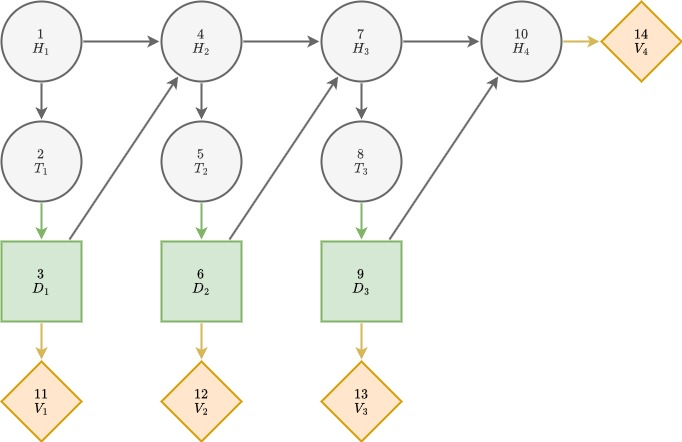

# [RJT model](@id RJT-model)
## Introduction
Influence diagrams can be represented as directed rooted trees composed of clusters. These can be transformed into gradual rooted junction trees (RJTs) by imposing additional constraints. An optimization model can then be formulated using gradual RJTs. Solving for optimal decision strategies using these formulations can be done with significantly less computing time than for full path based formulations. For this reason, using RJT based formulations is generally preferable.

The explanations for RJT construction and RJT based model formulation largely follow Herrala et al. (2024). [^1]

## Converting influence diagrams to RJTs

An influence diagram $G = (N, A)$ can be represented as a directed rooted tree $\mathscr{G} = (\mathscr{V}, \mathscr{A})$ composed of *clusters* $C \isin V$, which are subsets of the nodes of the ID, that is, $C \subset \mathscr{V}$. Both $G$ and $\mathscr{G}$ are directed acyclic graphs whose vertices are connected with directed arcs in $A$ and $\mathscr{A}$ , respectively. The main difference between these diagrams lies in the nature of the vertices. In an influence diagram, the set of nodes $N$ consists of individual chance events, decisions and consequences, while the clusters in $\mathscr{V}$ comprise multiple nodes, hence the notational distinction between $N$ and $\mathscr{V}$.

In order to reformulate this tree into a MIP model, additional constraints need to be imposed, making $\mathscr{G}$ a *gradual rooted junction tree*. A directed rooted tree $\mathscr{G} = (\mathscr{V}, \mathscr{A})$ consisting of clusters $C \in \mathscr{V}$ of nodes $j \in N$ is a gradual rooted junction tree corresponding to the influence diagram $G$ if:

 1. Given two clusters $C_1$ and $C_2$ in the junction tree, any cluster $C$ on the unique undirected path between $C_1$ and $C_2$ satisfies $C_1 \cap C_2 \subset C$. 
 2. Each cluster $C \in \mathscr{V}$ is the root cluster of exactly one node $j \in N$ (that is, the root of the subgraph induced by the clusters with node $j$) and all nodes $j \in N$ appear in at least one of the clusters.
 3. For each cluster, $I(j) \in C_j$, where $C_j$ is the _root cluster_ of $j \in N$.

A rooted tree satisfying condition (1) is said to satisfy the *running intersection property*. This condition is sufficient for making $\mathscr{G}$ a rooted junction tree (RJT). In addition, as a consequence of condition (2), we see that a gradual RJT has as many clusters as the original influence diagram has nodes, and each node $j \in N$ can be thought as corresponding to one of the clusters $C \in \mathscr{V}$. Because of this, we refer to clusters using the corresponding nodes $j \in N$ in the influence diagram as the *root cluster* of node $j \in N$, which is denoted as $C_j \in \mathscr{V}$.

An example of influence diagram (upper figure) conversion to RJT (lower figure) for pig breeding problem with $N=4$ is shown below.

  

## Formulating an optimization problem based on gradual RJT

Formulating an optimization model based on the gradual RJT representation starts by introducing a vector of moments $\mu_{C_j}$ for each cluster $C_j, \ j \in N$. Parmentier et al. (2020) [^2] show that for RJTs, we can impose constraints so that these become moments of a distribution $\mu_N$ that factorizes according to $G(N,A)$. The joint distribution $\mathbb{P}$ is said to factorize [^3] according to $G$ if $\mathbb{P}$ can be expressed as 

$$\mathbb{P}(X_N = s_N) = \prod_{j \in N}\mathbb{P}(X_j=s_j \mid X_{I(j)}=s_{I(j)}).\tag{1}$$

In the formulation, $\mu_{C_j}(s_{C_j})$ represents the probability of the nodes within the cluster $C_j$ being in states $s_{C_j}$ and condition (3) of definition above ensures that $\mathbb{P}(X_j=s_j \mid X_{I(j)}=s_{I(j)})$ can thus be obtained from $\mu_{C_j}(s_{C_j})$ for each $j \in N$.

Variable definitions are given in the influence diagram section.

## MIP model formulation

### Objective function

Based on the observations above, the MIP model can be formulated. The objective function becomes:

$${\text{maximize}} \sum_{j \in N^V} \sum_{s_{C_j} \in S_{C_j}} \mu_{C_j}(s_{C_j}) u_{C_j}(s_{C_j})\tag{2}$$

This represents an expected utility maximization problem where $u_{C_j}$ represent the utility values associated with different realizations of the nodes within the cluster $C_j$.

### Constraints
#### Decision variables

Only one positive decision can be taken given the same information:

$$\sum_{s_j \in S_{I(j)}}\delta (s_j \mid s_{I(j)})=1, \ \forall j \in N^D, s_{I(j)} \in S_{I(j)}\tag{3}$$

#### μ-variables

μ-variables need to represent valid probability distributions with probabilities summing up to 1. Thus, we get constraint:

$$\sum_{s_{C_j} \in S_{C_j}} \mu_{C_j}(s_{C_j}) = 1, \ \forall j \in N\\\tag{3}$$

We use moments $\mu_{\overline{C}_j}$ (μ_bar in the code) to ease the notation. These are defined as

$$\mu_{\overline{C}_j}(s_{\overline{C}_j}) = \sum_{s_j \in S_j} \mu_{C_j}(s_{C_j})\tag{4}$$

representing the marginal distribution for cluster $C_j$ with the node $j$ marginalized out. $\overline{C}_j = C_j \setminus j$ is used for notational brevity.

#### Local consistency

The following constraint enforces local consistency between adjacent clusters, meaning that for a pair $C_i, C_j$ of adjacent clusters, the marginal distribution for the nodes in both $C_i$ and $C_j$ (that is, $C_i \cap C_j$) must be the same when obtained from either $C_i$ or $C_j$. This is formulated as:

$$\sum_{\substack{s_{C_i} \in S_{C_i}, \\ s_{C_i \cap C_j} = s^*_{C_i \cap C_j}}} \mu_{C_i}(s_{C_i})= \sum_{\substack{s_{C_j} \in S_{C_j}, \\ s_{C_i \cap C_j} = s^*_{C_i \cap C_j}}} \mu_{C_j}(s_{C_j}),  \nonumber\\ \tag{5}$$

$$\qquad\qquad\qquad\qquad  \ \forall (C_i,C_j) \in \mathscr{A}, s^*_{C_i \cap C_j} \in S_{C_i \cap C_j}\\$$

#### Conditional probabilities and decision strategies

Moments $\mu_{\overline{C}_j}$ defined above are used here. We get constraints:

$$\mu_{C_j}(s_{C_j}) = \mu_{\overline{C}_j}(s_{\overline{C}_j}) p(s_j \mid s_{I(j)}), \ \forall j \in N^C \cup N^V, s_{C_j} \in S_{C_j} \tag{6}\\$$

$$\mu_{C_j}(s_{C_j}) \le \delta(s_j \mid s_{I(j)}), \ \forall j \in N^D, s_{C_j} \in S_{C_j} \tag{7}\\$$

The value $p(s_j \mid s_{I(j)})$ is the conditional probability of a state $s_j$ given the information state $s_{I(j)}$ and $\delta(s_j \mid s_{I(j)})$ the decision strategy in node $j \in N^D$.

#### Non-negativity and integer constraints

All probability and decision variables have to be non-negative. Decision variables are binary.

$$\mu_{C_j}(s_{C_j}) \ge 0, \ \forall j \in N, s_{C_j} \in S_{C_j}\tag{8}$$

$$\delta(s_j \mid s_{I(j)}) \in \{0,1\}, \ \forall j \in N^D, s_j \in S_j, s_{I(j)} \in S_{I(j)}\tag{9}$$

## Computational considerations

## References

[^1]: Herrala, O., Terho, T., Oliveira, F., 2024. Risk-averse decision strategies for influence diagrams using rooted junction trees. Retrieved from [https://arxiv.org/abs/2401.03734]

[^2]: Parmentier, A., Cohen, V., Leclere, V., Obozinski, G., Salmon, J., 2020. `
Integer programming on the junction tree polytope for influence diagrams. INFORMS Journal on Optimization 2, 209–228.

[^3]: Koller, D., Friedman, N., 2009. Probabilistic graphical models: principles
and techniques. MIT press