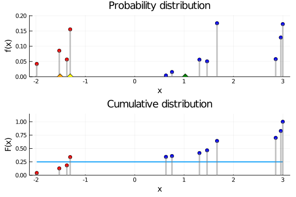

# [Analyzing Decision Strategies](@id analyzing-decision-strategies)
## Introduction
This section focuses on how we can analyze fixed decision strategies $Z$ on an influence diagram $G$, such as ones obtained by solving the Decision Programming model described in [the previous section](@ref decision-model). We can rule out all incompatible and inactive paths from the analysis because they do not influence the outcomes of the strategy. This means that we only consider paths $𝐬$ that are compatible and active $𝐬 \in 𝐒(X) \cap 𝐒(Z)$.

## Generating Compatible Paths
We can generate compatible paths $𝐬∈𝐒(Z)$ as follows.

1) Initialize path $𝐬$ of length $n$ with undefined values.
2) Fill path with chance states $s_j∈S_j$ for all $j∈C.$
3) In increasing order of decision nodes $j∈D$, fill decision states by computing decision strategy $s_j=Z_j(𝐬_{I(j)}).$

## Utility Distribution
We define unique path utility values as

$$\mathcal{U}^∗=\{\mathcal{U}(𝐬)∣𝐬∈𝐒(Z)\}.$$

The probability mass function of the **utility distribution** associates each unique path utility to a probability as follows

$$ℙ(X=u)=∑_{𝐬∈𝐒(Z)∣\mathcal{U}(𝐬)=u} p(𝐬),\quad ∀u∈\mathcal{U}^∗.$$

From the utility distribution, we can calculate the cumulative distribution, statistics, and risk measures. The relevant statistics are expected value, standard deviation, skewness and kurtosis. Risk measures focus on the conditional value-at-risk (CVaR), also known as expected shortfall.

## Measuring Risk

We have a discrete probability distribution $f(x)=ℙ(X=x)∈[0, 1]$ over the domain $x∈Ω$ with $∑_{x∈Ω}ℙ(X=x)=1$ and its cumulative distribution function $F(x) = ∑_{x^′∈Ω∣x^′≤x}f(x^′).$ We define the expected value as

$$E(X)=∑_{x∈Ω} x ⋅ f(x).$$

We present the concept of conditional value-at-risk, a *risk measure* of the conditional expected value of the tail of a probability distribution for a given **probability level** of $α∈[0, 1].$ First, we define the **value-at-risk** as

$$\operatorname{VaR}_α(X) = x_α = \min\{x∈Ω ∣ F(x) ≥ α\}.$$

It is the smallest value $x$ such that the cumulative probability is equal or above $α.$ Then, we define the **conditional value-at-risk** as

$$\operatorname{CVaR}_α(X)=\textcolor{darkorange}{\frac{1}{α}} \left(\textcolor{darkred}{∑_{x≤x_α} x ⋅ f(x)} \textcolor{darkblue}{- \left(∑_{x≤x_α} f(x) - α\right) x_α }\right).$$

The red part measures the conditional expected value of the tail distribution. The blue part corrects the expected value by subtracting the amount of expected value that is between probability level $α$ and $F(x_α)$ and orange part divides by the total probability.

Value-at-risk and conditional value-at-risk are monotonically increasing functions. Therefore, the lower bound is the value at $α=0$ and the upper bound is the value at $α=1.$ For value-at-risk, we have

$$\operatorname{VaR}_0(X) = \min \{x∈Ω\},$$

$$\operatorname{VaR}_1(X) = \max \{x∈Ω\}.$$

For conditional value-at-risk, we have

$$\lim_{α→0} \operatorname{CVaR}_α(X) = \operatorname{VaR}_0(X),$$

$$\operatorname{CVaR}_1(X) = E(X).$$

The above figure demonstrates these values on a discrete probability distribution.

## State Probabilities
We use a recursive definition where $ϵ$ denotes an empty state to denote **paths with fixed states**.

$$\begin{aligned}
𝐒_{ϵ} &= 𝐒(Z) \\
𝐒_{ϵ,s_i} &= \{𝐬∈𝐒_{ϵ} ∣ 𝐬_i=s_i\} \\
𝐒_{ϵ,s_i,s_j} &= \{𝐬∈𝐒_{ϵ,s_i} ∣ 𝐬_j=s_j\},\quad j≠i
\end{aligned}$$

The probability of all paths sums to one

$$ℙ(ϵ) = \sum_{𝐬∈𝐒_ϵ} p(𝐬) = 1.$$

**State probabilities** for each node $i∈C∪D$ and state $s_i∈S_i$ denote how likely the state occurs given all path probabilities

$$ℙ(s_i∣ϵ) = \sum_{𝐬∈𝐒_{ϵ,s_i}} \frac{p(𝐬)}{ℙ(ϵ)} = \sum_{𝐬∈𝐒_{ϵ,s_i}} p(𝐬)$$

An **active state** is a state with positive state probability $ℙ(s_i∣c)>0$ given conditions $c.$

We can **generalize the state probabilities** as conditional probabilities using a recursive definition. Generalized state probabilities allow us to explore how fixing active states affect the probabilities of other states. First, we choose an active state $s_i$ and fix its value. Fixing an inactive state would make all state probabilities zero. Then, we can compute the conditional state probabilities as follows.

$$ℙ(s_j∣ϵ,s_i) = \sum_{𝐬∈𝐒_{ϵ,s_i,s_j}} \frac{p(𝐬)}{ℙ(s_i∣ϵ)}$$

We can then repeat this process by choosing an active state from the new conditional state probabilities $s_k$ that is different from previously chosen states $k≠j.$
