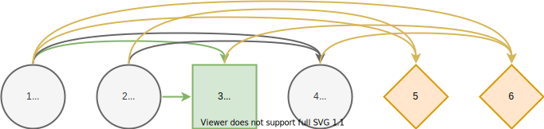
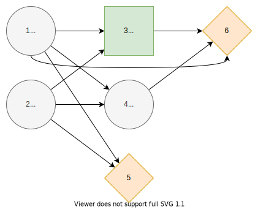

# Influence Diagram
## Introduction
Based on [^1], sections 3.

The paper [^2] explains details about influence diagrams.

## Definition
We define the **influence diagram** as a directed, acyclic graph

$$G=(C,D,V,I,S).$$

The nodes $N=C∪D∪V$ consists of **chance nodes** $C,$ **decision nodes** $D,$ and **value nodes** $V$. We index the chance and decision nodes such that $C∪D=\{1,...,n\}$ and values nodes such that $V=\{n+1,...,n+|V|\}$ where $n=|C|+|D|.$

We define the **information set** $I$ of node $j∈N$ as

$$I(j)⊆\{i∈C∪D∣i<j\}$$

The condition enforces that the graph is directed and acyclic, and there are no arcs from value nodes to other nodes. Practically, the information set is an edge list to reverse direction in the graph.

We refer to $S$ as the **state space**. Each chance and decision node $j∈C∪D$ is associates with a finite number of **states** $S_j$ that we encode using integers $\{1,...,|S_j|\}$ from one to number of states $|S_j|.$

## Root and Leaf Nodes
In the subdiagram of $G$ which consists of the chance and decision nodes $j∈C∪D,$ we call node $j$ a **root** node if its information set if empty, that is, $I(j)=∅.$

Similarly, we call node $j$ a **leaf** node if it is not in any information set, that is, $j∉I(i)$ for all $i∈C∪D.$ Each leaf node must be in at least one of the information sets of value nodes. That is, for each leaf node $j$ exists a value node $i∈V$ such that $j∈I(i).$ Otherwise, the node $j$ is **redundant**.

## Visualization
To visualize influence diagrams, we define the different node types and how to order the nodes. There are two ways to order directed acyclic graphs, linear and depth-wise. We use [diagrams.net](https://www.diagrams.net/) for drawing influence diagrams.

### Node Types

We use a circle to represent chance nodes, square to represent decision nodes and diamond to represent value nodes. The symbol $i$ represents the node's index and symbol $S_i$ the states of the chance or decision node.

### Linear Order

We can order the nodes in increasing linear order based on indices.

### Depth-wise Order

We define the **depth** of a node $j∈N$ as follows. Root nodes have a depth of one

$$\operatorname{depth}(j)=1,\quad I(j)=∅.$$

Other nodes have a depth of one greater than the maximum depth of its predecessors

$$\operatorname{depth}(j)=\max_{i∈I(j)} \operatorname{depth}(i) + 1,\quad I(j)≠∅.$$

We can group the nodes by their depth and then order them by increasing depth and increasing indices order within that depth. Compared to linear order, the depth-wise order is more concise. It displays more information about the influence relationships, because nodes can only be influenced by nodes with smaller depth.

## Paths
Paths in influence diagrams represent realizations of states for chance and decision nodes. Formally, a **path** is a sequence of states

$$𝐬=(s_1, s_2, ...,s_n),$$

where each state $s_i∈S_i$ for all chance and decision nodes $i∈C∪D.$

We define a **subpath** of $𝐬$ is a subsequence

$$(𝐬_{i_1}, 𝐬_{i_2}, ..., 𝐬_{i_{k}}),$$

where $1≤i_1<i_2<...<i_k≤n$ and $k≤n.$

The **information path** of node $j∈N$ on path $𝐬$ is a subpath defined as

$$𝐬_{I(j)}=(𝐬_i ∣ i∈I(j)).$$

We define the set of **all paths** as a product set of all states

$$𝐒=∏_{j∈C∪D} S_j.$$

The set of **information paths** of node $j∈N$ is the product set of the states in its information set

$$𝐒_{I(j)}=∏_{i∈I(j)} S_i.$$

We denote elements of the sets using notation $s_j∈S_j$, $𝐬∈𝐒$, and $𝐬_{I(j)}∈𝐒_{I(j)}.$

## Probabilities
For each chance node $j∈C$, we denote the **probability** of state $s_j$ given information path $𝐬_{I(j)}$ as

$$ℙ(X_j=s_j∣X_{I(j)}=𝐬_{I(j)})=ℙ(s_j∣𝐬_{I(j)})∈[0, 1],$$

with

$$∑_{s_j∈S_j} ℙ(s_j∣𝐬_{I(j)}) = 1.$$

We refer to a chance state $s_j∈S_j$ given information path $𝐬_{I(j)}$ as **inactive** if its probability is zero $ℙ(s_j∣𝐬_{I(j)})=0.$

Implementation wise, we can think probabilities as functions of information paths concatenated with state $X_j : 𝐒_{I(j)};S_j → [0, 1]$ where $∑_{s_j∈S_j} X_j(𝐬_{I(j)};s_j)=1.$

## Decision Strategy
For each decision node $j∈D,$ a **local decision strategy** maps an information path $𝐬_{I(j)}$ to a state $s_j$

$$Z_j:𝐒_{I(j)}↦S_j.$$

**Decision strategy** $Z$ contains one local decision strategy for each decision node. Set of **all decision strategies** is denoted $ℤ.$

A decision stategy $Z∈ℤ$ is **compatible** with the path $𝐬∈𝐒$ if and only if $Z_j(𝐬_{I(j)})=s_j$ forall $Z_j∈Z$ and $j∈D.$

## Path Probability
We define the **path probability (upper bound)** as

$$p(𝐬) = ∏_{j∈C} ℙ(𝐬_j∣𝐬_{I(j)}).$$

The path probability $ℙ(𝐬∣Z)$ equals $p(𝐬)$ if the path $𝐬$ is compatible with the decision strategy $Z$. Otherwise, the path cannot occur, and the probability is zero.

## Consequences
For each value node $j∈V$, we define the **consequence** given information path $𝐬_{I(j)}$ as

$$Y_j:𝐒_{I(j)}↦ℂ,$$

where $ℂ$ is the set of real-valued consequences.

## Path Utility
The **utility function** is a function that maps consequences to real-valued utility

$$U:ℂ^{|V|}↦ℝ.$$

The **path utility** is defined as the utility function acting on the consequences of value nodes given their information paths

$$\mathcal{U}(𝐬) = U(\{Y_j(𝐬_{I(j)}) ∣ j∈V\}).$$

The **default path utility** is the sum of consequences

$$\mathcal{U}(𝐬) = ∑_{j∈V} Y_j(𝐬_{I(j)}).$$

## Path Distribution
A **path distribution** is a pair

$$(ℙ(𝐬∣Z), \mathcal{U}(𝐬))$$

that comprises of path probability function and path utility function over paths $𝐬∈𝐒$ conditional to the decision strategy $Z.$

## Active Paths
An **active path** is a path $𝐬∈𝐒$ that has positive path probability $ℙ(𝐬∣Z)>0.$ We denote the set of **all active paths** given a decision strategy $Z$ as

$$𝐒(Z)=\{𝐬∈𝐒 ∣ ℙ(𝐬∣Z)>0\}.$$

Since each decision strategy $Z_j$ chooses only one of its states the **number of active paths** is bounded by

$$|𝐒(Z)|≤|𝐒|/\prod_{j∈D}|S_j|=\prod_{j∈C}|S_j|.$$

If an influece diagram has **zero inactive chance states** the number of active paths is equal to the upper bound

$$|𝐒(Z)|=\prod_{j∈C}|S_j|.$$

## Properties
In this section, we define common properties for influence diagrams. The paper [^2] discusses many of these properties.

**Discrete** influence diagram refers to countable state space. Otherwise, the influence diagram is **continuous**. We can discretize continuous influence diagrams using discrete bins.

Influence diagram is **symmetric** if there is zero inactive chance states. Otherwise, it is **assymetric**.

Two nodes are **sequential** if there exists a directed path from one node to the other in the influence diagram. Otherwise, the nodes are **parallel**. Sequential nodes often model time dimension.

**Repeated subdiagram** refers to a recurring pattern within an influence diagram. Often, influence diagrams do not have a unique structure, but they consist of a repeated pattern due to the underlying problem's properties.

**Limited-memory** influence diagram refers to an influence diagram where an upper bound limits the size of the information set for decision nodes. It is a desired attribute because it affects the decision model size, as discussed in the [Computational Complexity](@ref) section.

**Isolated subdiagrams** refer to an influence diagram that consists of multiple unconnected diagrams, that is, there are no undirected connections between the diagrams. Therefore, one isolated subdiagram's decisions affect decisions on the other isolated subdiagrams only through the utility function.

## References
[^1]: Salo, A., Andelmin, J., & Oliveira, F. (2019). Decision Programming for Multi-Stage Optimization under Uncertainty, 1–35. Retrieved from [http://arxiv.org/abs/1910.09196](http://arxiv.org/abs/1910.09196)

[^2]: Bielza, C., Gómez, M., & Shenoy, P. P. (2011). A review of representation issues and modeling challenges with influence diagrams. Omega, 39(3), 227–241. https://doi.org/10.1016/j.omega.2010.07.003
