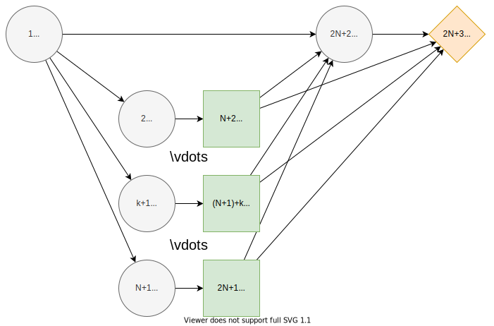

# N-Monitoring
## Description
The $N$-monitoring problem is described in [^1], sections 4.1 and 6.1.


## Influence Diagram


The influence diagram of the generalized $N$-monitoring problem where $N≥1$ and indices $k=1,...,N.$ The nodes are associated with states as follows. **Load state** $L=\{high, low\}$ denotes the load on a structure, **report states** $R_k=\{high, low\}$ report the load state to the **action states** $A_k=\{yes, no\}$ which represent different decisions to fortify the structure. The **failure state** $F=\{failure, success\}$ represents whether or not the (fortified) structure fails under the load $L$. Finally, the utility at target $T$ depends on the fortification costs and whether F fails.

We begin by choosing $N$ and defining our fortification cost function. We draw the cost of fortification $c_k∼U(0,1)$ from a uniform distribution, and the magnitude of fortification is directly proportional to the cost. Fortification is defined as

$$f(A_k=yes) = c_k$$

$$f(A_k=no) = 0$$

```julia
using Random
using JuMP, HiGHS
using DecisionProgramming

const N = 4

Random.seed!(13)
const c_k = rand(N)
const b = 0.03
fortification(k, a) = [c_k[k], 0][a]
```

### Initialising the influence diagram
We initialise the influence diagram before adding nodes to it.

```julia
diagram = InfluenceDiagram()
```

### Adding nodes
Add node $L$ which represents the load on the structure. This node is the root node and thus, has an empty information set. Its states describe the state of the load, they are $high$ and $low$.

```julia
add_node!(diagram, ChanceNode("L", [], ["high", "low"]))
```

The report nodes $R_k$ and action nodes $A_k$ are easily added with a for-loop. The report nodes have node $L$ in their information sets and their states are $high$ and $low$. The actions are made based on these reports, which is represented by the action nodes $A_k$ having the report nodes $R_k$ in their information sets. The action nodes have states $yes$ and $no$, which represents decisions whether to fortify the structure or not.

```julia
for i in 1:N
    add_node!(diagram, ChanceNode("R$i", ["L"], ["high", "low"]))
    add_node!(diagram, DecisionNode("A$i", ["R$i"], ["yes", "no"]))
end
```

The failure node $F$ has the load node $L$ and all of the action nodes $A_k$ in its information set. The failure node has states $failure$ and $success$.
```julia
add_node!(diagram, ChanceNode("F", ["L", ["A$i" for i in 1:N]...], ["failure", "success"]))
```

The value node $T$ is added as follows.
```julia
add_node!(diagram, ValueNode("T", ["F", ["A$i" for i in 1:N]...]))
```

### Generating arcs
Now that all of the nodes have been added to the influence diagram we generate the arcs between the nodes. This step automatically orders the nodes, gives them indices and reorganises the information into the appropriate form.
```julia
generate_arcs!(diagram)
```


### Load State Probabilities
After generating the arcs, the probabilities and utilities can be added. The probability that the load is high, $ℙ(L=high)$, is drawn from a uniform distribution. For different syntax options for adding probabilities and utilities, see the [usage page](../usage.md).

$$ℙ(L=high)∼U(0,1)$$

```julia
X_L = [rand(), 0]
X_L[2] = 1.0 - X_L[1]
add_probabilities!(diagram, "L", X_L)
```

### Reporting Probabilities
The probabilities of the report states correspond to the load state. We draw the values $x∼U(0,1)$ and $y∼U(0,1)$ from uniform distributions.

$$ℙ(R_k=high∣L=high)=\max\{x,1-x\}$$

$$ℙ(R_k=low∣L=low)=\max\{y,1-y\}$$

The probability of a correct report is thus in the range [0.5,1]. (This reflects the fact that a probability under 50% would not even make sense, since we would notice that if the test suggests a high load, the load is more likely to be low, resulting in that a low report "turns into" a high report and vice versa.)

In Decision Programming we add these probabilities by declaring probabilty matrices for nodes $R_k$. The probability matrix of a report node $R_k$ has dimensions (2,2), where the rows correspond to the states $high$ and $low$ of its predecessor node $L$ and the columns to its own states $high$ and $low$.

```julia
for i in 1:N
    x_R, y_R = rand(2)
    X_R = ProbabilityMatrix(diagram, "R$i")
    X_R["high", "high"] = max(x_R, 1-x_R)
    X_R["high", "low"] = 1 - max(x_R, 1-x_R)
    X_R["low", "low"] = max(y_R, 1-y_R)
    X_R["low", "high"] = 1-max(y_R, 1-y_R)
    add_probabilities!(diagram, "R$i", X_R)
end
```

### Probability of Failure
The probability of failure is decresead by fortification actions. We draw the values $x∼U(0,1)$ and $y∼U(0,1)$ from uniform distribution.

$$ℙ(F=failure∣A_N,...,A_1,L=high)=\frac{\max{\{x, 1-x\}}}{\exp{(b ∑_{k=1,...,N} f(A_k))}}$$

$$ℙ(F=failure∣A_N,...,A_1,L=low)=\frac{\min{\{y, 1-y\}}}{\exp{(b ∑_{k=1,...,N} f(A_k))}}$$

First we initialise the probability matrix for node $F$.
```julia
X_F = ProbabilityMatrix(diagram, "F")
```

This matrix has dimensions $(2, \textcolor{orange}{2, 2, 2, 2}, 2)$ because node $L$ and nodes $A_k$, which form the information set of $F$, all have 2 states and node $F$ itself also has 2 states. The orange colored dimensions correspond to the states of the action nodes $A_k$.

To set the probabilities we have to iterate over the information states. Here it helps to know that in Decision Programming the states of each node are mapped to numbers in the back-end. For instance, the load states $high$ and $low$ are referred to as 1 and 2. The same applies for the action states $yes$ and $no$, they are states 1 and 2. The `paths` function allows us to iterate over the subpaths of specific nodes. In these paths, the states are referred to by their indices. Using this information, we can easily iterate over the information states using the `paths` function and enter the probability values into the probability matrix.


```julia
x_F, y_F = rand(2)
for s in paths([State(2) for i in 1:N])
    denominator = exp(b * sum(fortification(k, a) for (k, a) in enumerate(s)))
    X_F[1, s..., 1] = max(x_F, 1-x_F) / denominator
    X_F[1, s..., 2] = 1.0 - X_F[1, s..., 1]
    X_F[2, s..., 1] = min(y_F, 1-y_F) / denominator
    X_F[2, s..., 2] = 1.0 - X_F[2, s..., 1]
end
```

After declaring the probability matrix, we add it to the influence diagram.
```julia
add_probabilities!(diagram, "F", X_F)
```

### Utility
The utility from the different scenarios of the failure state at target $T$ are

$$g(F=failure) = 0$$

$$g(F=success) = 100.$$

Utilities from the action states $A_k$  at target $T$ are

$$f(A_k=yes) = c_k$$

$$f(A_k=no) = 0.$$

The total cost is thus

$$Y(F, A_N, ..., A_1) = g(F) + (-f(A_N)) + ... + (-f(A_1)).$$

We first declare the utility matrix for node $T$.
```julia
Y_T = UtilityMatrix(diagram, "T")
```
This matrix has dimensions $(2, \textcolor{orange}{2, 2, 2, 2})$, where the dimensions correspond to the numbers of states the nodes in the information set have. Similarly as before, the first dimension corresponds to the states of node $F$ and the other 4 dimensions (in orange) correspond to the states of the $A_k$ nodes. The utilities are set and added similarly to how the probabilities were added above.

```julia
for s in paths([State(2) for i in 1:N])
    cost = sum(-fortification(k, a) for (k, a) in enumerate(s))
    Y_T[1, s...] = 0 + cost
    Y_T[2, s...] = 100 + cost
end
add_utilities!(diagram, "T", Y_T)
```

### Generate Influence Diagram
The full influence diagram can now be generated. We use the default path probabilities and utilities, which are the default setting in this function. In the [Contingent Portfolio Programming](contingent-portfolio-programming.md) example, we show how to use a user-defined custom path utility function.

In this particular problem, some of the path utilities are negative. In this case, we choose to use the [positive path utility](../decision-programming/decision-model.md) transformation, which translates the path utilities to positive values. This allows us to exclude the probability cut in the next section.

```julia
generate_diagram!(diagram, positive_path_utility = true)
```

## Decision Model
We initialise the JuMP model and declare the decision and path compatibility variables. Since we applied an affine transformation to the utility function, the probability cut can be excluded from the model formulation.

```julia
model = Model()
z = DecisionVariables(model, diagram)
x_s = PathCompatibilityVariables(model, diagram, z, probability_cut = false)
```

The expected utility is used as the objective and the problem is solved using Gurobi.

```julia
EV = expected_value(model, diagram, x_s)
@objective(model, Max, EV)
```

Alternatively, RJT formulation can be used by replacing commands on path compatibility variables and objective function creation with commands

```julia
μ_s = RJTVariables(model, diagram, z)
EV = expected_value(model, diagram, μ_s)
@objective(model, Max, EV)
```

and then solving using the solver. Significantly faster solving times are expected using RJT formulation.

```julia
optimizer = optimizer_with_attributes(
    () -> HiGHS.Optimizer()
)
set_optimizer(model, optimizer)
optimize!(model)
```


## Analyzing Results

We obtain the decision strategy, state probabilities and utility distribution from the solution. Julia version 1.10.3 was used in random number generation (the version used might affect the results).

```julia
Z = DecisionStrategy(diagram, z)
U_distribution = UtilityDistribution(diagram, Z)
S_probabilities = StateProbabilities(diagram, Z)
```

The decision strategy shows us that the optimal strategy is to make all four fortifications regardless of the reports.

```julia-repl
julia> print_decision_strategy(diagram, Z, S_probabilities)
┌────────────────┬────────────────┐
│ State(s) of R1 │ Decision in A1 │
├────────────────┼────────────────┤
│ high           │ yes            │
│ low            │ no             │
└────────────────┴────────────────┘
┌────────────────┬────────────────┐
│ State(s) of R2 │ Decision in A2 │
├────────────────┼────────────────┤
│ high           │ yes            │
│ low            │ no             │
└────────────────┴────────────────┘
┌────────────────┬────────────────┐
│ State(s) of R3 │ Decision in A3 │
├────────────────┼────────────────┤
│ high           │ yes            │
│ low            │ yes            │
└────────────────┴────────────────┘
┌────────────────┬────────────────┐
│ State(s) of R4 │ Decision in A4 │
├────────────────┼────────────────┤
│ high           │ yes            │
│ low            │ no             │
└────────────────┴────────────────┘
```


The state probabilities for strategy $Z$ are also obtained. These tell the probability of each state in each node, given strategy $Z$.

```julia-repl
julia> print_state_probabilities(diagram, S_probabilities, ["L"])
┌────────┬──────────┬──────────┬─────────────┐
│   Node │     high │      low │ Fixed state │
│ String │  Float64 │  Float64 │      String │
├────────┼──────────┼──────────┼─────────────┤
│      L │ 0.586000 │ 0.414000 │             │
└────────┴──────────┴──────────┴─────────────┘
julia> print_state_probabilities(diagram, S_probabilities, [["R$i" for i in 1:N]...])
┌────────┬──────────┬──────────┬─────────────┐
│   Node │     high │      low │ Fixed state │
│ String │  Float64 │  Float64 │      String │
├────────┼──────────┼──────────┼─────────────┤
│     R1 │ 0.737028 │ 0.262972 │             │
│     R2 │ 0.501345 │ 0.498655 │             │
│     R3 │ 0.449940 │ 0.550060 │             │
│     R4 │ 0.462002 │ 0.537998 │             │
└────────┴──────────┴──────────┴─────────────┘
julia> print_state_probabilities(diagram, S_probabilities, [["A$i" for i in 1:N]...])
┌────────┬──────────┬──────────┬─────────────┐
│   Node │      yes │       no │ Fixed state │
│ String │  Float64 │  Float64 │      String │
├────────┼──────────┼──────────┼─────────────┤
│     A1 │ 0.737028 │ 0.262972 │             │
│     A2 │ 0.501345 │ 0.498655 │             │
│     A3 │ 1.000000 │ 0.000000 │             │
│     A4 │ 0.462002 │ 0.537998 │             │
└────────┴──────────┴──────────┴─────────────┘
julia> print_state_probabilities(diagram, S_probabilities, ["F"])
┌────────┬──────────┬──────────┬─────────────┐
│   Node │  failure │  success │ Fixed state │
│ String │  Float64 │  Float64 │      String │
├────────┼──────────┼──────────┼─────────────┤
│      F │ 0.395566 │ 0.604434 │             │
└────────┴──────────┴──────────┴─────────────┘
```

We can also print the utility distribution for the optimal strategy and some basic statistics for the distribution.

```julia-repl
julia> print_utility_distribution(U_distribution)
┌───────────┬─────────────┐
│   Utility │ Probability │
│   Float64 │     Float64 │
├───────────┼─────────────┤
│ -1.806271 │    0.164580 │
│ -1.715238 │    0.104478 │
│ -1.654847 │    0.009397 │
│ -1.563813 │    0.006952 │
│ -0.924416 │    0.045627 │
│ -0.833383 │    0.038920 │
│ -0.772991 │    0.007659 │
│ -0.681958 │    0.017953 │
│ 98.193726 │    0.112766 │
│ 98.284760 │    0.077866 │
│ 98.345154 │    0.009793 │
│ 98.436188 │    0.015513 │
│ 99.075584 │    0.063066 │
│ 99.166618 │    0.129725 │
│ 99.227005 │    0.049114 │
│ 99.318039 │    0.146591 │
└───────────┴─────────────┘
```

```julia-repl
julia> print_statistics(U_distribution)
┌──────────┬────────────┐
│     Name │ Statistics │
│   String │    Float64 │
├──────────┼────────────┤
│     Mean │  59.165647 │
│      Std │  49.083835 │
│ Skewness │  -0.427074 │
│ Kurtosis │  -1.817258 │
└──────────┴────────────┘
```


## References
[^1]: Salo, A., Andelmin, J., & Oliveira, F. (2019). Decision Programming for Multi-Stage Optimization under Uncertainty, 1–35. Retrieved from [http://arxiv.org/abs/1910.09196](http://arxiv.org/abs/1910.09196)
