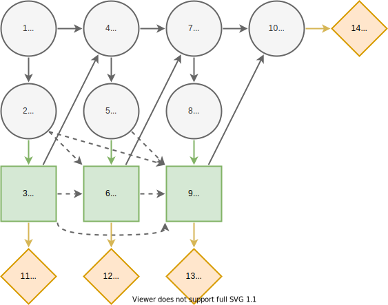

# Pig Breeding
## Description
The pig breeding problem as described in [^1].

> A pig breeder is growing pigs for a period of four months and subsequently selling them. During this period the pig may or may not develop a certain disease. If the pig has the disease at the time it must be sold, the pig must be sold for slaughtering, and its expected market price is then 300 DKK (Danish kroner). If it is disease free, its expected market price as a breeding animal is 1000 DKK
>
> Once a month, a veterinary doctor sees the pig and makes a test for presence of the disease. If the pig is ill, the test will indicate this with probability 0.80, and if the pig is healthy, the test will indicate this with probability 0.90. At each monthly visit, the doctor may or may not treat the pig for the disease by injecting a certain drug. The cost of an injection is 100 DKK.
>
> A pig has the disease in the first month with probability 0.10. A healthy pig develops the disease in the subsequent month with probability 0.20 without injection, whereas a healthy and treated pig develops the disease with probability 0.10, so the injection has some preventive effect. An untreated pig that is unhealthy will remain so in the subsequent month with probability 0.90, whereas the similar probability is 0.50 for an unhealthy pig that is treated. Thus spontaneous cure is possible, but treatment is beneficial on average.

## Formulation

The original $4$-month formulation.

The influence diagram for the the generalized $N$-month pig breeding. The nodes are associated with the following states. **Health states** $h_k=\{ill,healthy\}$ represents the health of the pig at month $k=1,...,N$. **Test states** $t_k=\{positive,negative\}$ represents the result from testing the pig at month $k=1,...,N-1$. **Treat state** $d_k=\{treat, pass\}$ represents the decision to treat the pig with an injection at month $k=1,...,N-1$. The dashed arcs represent the no-forgetting principle and we can toggle them on and off in the formulation.

The probabilities that test indicates pig's health correctly at month $k=1,...,N-1$.

$$ℙ(t_k = positive ∣ h_k = ill) = 0.8$$

$$ℙ(t_k = negative ∣ h_k = healthy) = 0.9$$

The probability that pig is ill in the first month.

$$ℙ(h_1 = ill)=0.1$$

The probability that the pig is ill in the subsequent months $k=2,...,N$ given the treatment decision in and state of health in the previous month.

$$ℙ(h_k = ill ∣ d_{k-1} = pass, h_{k-1} = healthy)=0.2$$

$$ℙ(h_k = ill ∣ d_{k-1} = treat, h_{k-1} = healthy)=0.1$$

$$ℙ(h_k = ill ∣ d_{k-1} = pass, h_{k-1} = ill)=0.9$$

$$ℙ(h_k = ill ∣ d_{k-1} = treat, h_{k-1} = ill)=0.5$$

The cost of treatment decision for the pig at month $k=1,...,N-1$

$$U(Y(d_k))=\begin{cases}
-100, & d_k = treat \\
0, & d_k = pass
\end{cases}$$

The price of given the pig health at month $N$

$$U(Y(h_N))=\begin{cases}
300, & h_N = ill \\
1000, & h_N = healthy
\end{cases}$$

Total utility

$$U(Y(h_N,d_{N-1},...,d_1))=U(Y(h_n))+∑_{k=1,...,N} U(Y(d_k)).$$

## References
[^1]: Lauritzen, S. L., & Nilsson, D. (2001). Representing and solving decision problems with limited information. Management Science, 47(9), 1235–1251. https://doi.org/10.1287/mnsc.47.9.1235.9779
