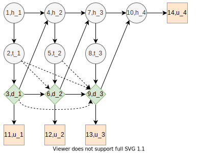

# Pig Breeding Problem
## Description
The pig breeding problem as described in [^1].

> A pig breeder is growing pigs for a period of four months and subsequently selling them. During this period the pig may or may not develop a certain disease. If the pig has the disease at the time it must be sold, the pig must be sold for slaughtering, and its expected market price is then 300 DKK (Danish kroner). If it is disease free, its expected market price as a breeding animal is 1000 DKK
>
> Once a month, a veterinary doctor sees the pig and makes a test for presence of the disease. If the pig is ill, the test will indicate this with probability 0.80, and if the pig is healthy, the test will indicate this with probability 0.90. At each monthly visit, the doctor may or may not treat the pig for the disease by injecting a certain drug. The cost of an injection is 100 DKK.
>
> A pig has the disease in the first month with probability 0.10. A healthy pig develops the disease in the subsequent month with probability 0.20 without injection, whereas a healthy and treated pig develops the disease with probability 0.10, so the injection has some preventive effect. An untreated pig that is unhealthy will remain so in the subsequent month with probability 0.90, whereas the similar probability is 0.50 for an unhealthy pig that is treated. Thus spontaneous cure is possible, but treatment is beneficial on average.

## Diagram

The diagram has the following states

Change nodes and states

* State $h_i$ represents the health of the pig at month $i$. Two possible states, *ill* and *healthy*.
* State $t_i$ represents the result from testing the pig  at month $i$. Two possible states, *positive*, and *negative*.

Decision nodes and states

* State $d_i$ represents the decision to treat the pig with injection at month $i$. Two possible states, *treat* and *pass*.

Value nodes and states

* Consequences $u_1,u_2,u_3$ represents the consequences from treating or not treating the pig.
* Consequence $u_4$ represents the consequence from health of the pig after four months.

Influence is represented by the arcs. Dashed arcs represent *no forgetting* principle.

Probabilities

$$ℙ(t_i = positive ∣ h_i = ill) = 0.8$$

$$ℙ(t_i = negative ∣ h_i = healthy) = 0.9$$

$$ℙ(h_1 = ill)=0.1$$

$$ℙ(h_i = ill ∣ h_i = healthy, d_i = pass)=0.2, i≥2$$

$$ℙ(h_i = ill ∣ h_i = healthy, d_i = treat)=0.1, i≥2$$

$$ℙ(h_i = ill ∣ h_i = ill, d_i = pass)=0.9, i≥2$$

$$ℙ(h_i = ill ∣ h_i = ill, d_i = treat)=0.5, i≥2$$

Utilities

- Cost of treating the pig $U(Y(d_i=treat))=-100$
- Cost of not treating the pig $U(Y(d_i=pass))=0$
- Price of unhealthy pig $U(Y(h_4=ill))=300$
- Price of healthy pig $U(Y(h_4=healthy))=1000$

## Results

## References
[^1]: Lauritzen, S. L., & Nilsson, D. (2001). Representing and solving decision problems with limited information. Management Science, 47(9), 1235–1251. https://doi.org/10.1287/mnsc.47.9.1235.9779
