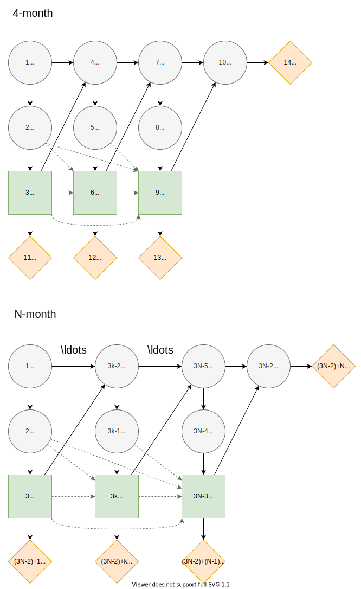

# [Pig Breeding](@id pig-breeding)
## Description
The pig breeding problem as described in [^1].

>A pig breeder is growing pigs for a period of four months and subsequently selling them. During this period the pig may or may not develop a certain disease. If the pig has the disease at the time it must be sold, the pig must be sold for slaughtering, and its expected market price is then 300 DKK (Danish kroner). If it is disease free, its expected market price as a breeding animal is 1000 DKK
>
>Once a month, a veterinary doctor sees the pig and makes a test for presence of the disease. If the pig is ill, the test will indicate this with probability 0.80, and if the pig is healthy, the test will indicate this with probability 0.90. At each monthly visit, the doctor may or may not treat the pig for the disease by injecting a certain drug. The cost of an injection is 100 DKK.
>
>A pig has the disease in the first month with probability 0.10. A healthy pig develops the disease in the subsequent month with probability 0.20 without injection, whereas a healthy and treated pig develops the disease with probability 0.10, so the injection has some preventive effect. An untreated pig that is unhealthy will remain so in the subsequent month with probability 0.90, whereas the similar probability is 0.50 for an unhealthy pig that is treated. Thus spontaneous cure is possible, but treatment is beneficial on average.


## Influence diagram


The influence diagram for the generalized $N$-month pig breeding problem. The nodes are associated with the following states. **Health states** $h_k=\{ill,healthy\}$ represent the health of the pig at month $k=1,...,N$. **Test states** $t_k=\{positive,negative\}$ represent the result from testing the pig at month $k=1,...,N-1$. **Treatment states** $d_k=\{treat, pass\}$ represent the decision to treat the pig with an injection at month $k=1,...,N-1$.

> The dashed arcs represent the no-forgetting principle. The no-forgetting assumption does not hold without them and they are tnot included in the following model. They could be included by changing the information sets of nodes.

In this example, we solve the 4 month pig breeding problem and thus, declare $N = 4$.

```julia
using JuMP, HiGHS
using DecisionProgramming

const N = 4
```
In Decision Programming, we start by initialising an empty influence diagram. Then we define the nodes with their information sets and states and add them to the influence diagram.
```julia
diagram = InfluenceDiagram()
```


### Health at first month

As seen in the influence diagram, the node $h_1$ has no arcs into it making it a root node. Therefore, the information set $I(h_1)$ is empty. The states of this node are $ill$ and $healthy$.


```julia
add_node!(diagram, ChanceNode("H1", [], ["ill", "healthy"]))
```

### Health, test results and treatment decisions at subsequent months
The chance and decision nodes representing the health, test results, treatment decisions for the following months can be added easily using a for-loop. The value node representing the treatment costs in each month is also added. Each node is given a name, its information set and states. Remember that value nodes do not have states. Notice that we do not assume the no-forgetting principle and thus, the information sets of the treatment decisions only contain the previous test result.

```julia
for i in 1:N-1
    # Testing result
    add_node!(diagram, ChanceNode("T$i", ["H$i"], ["positive", "negative"]))
    # Decision to treat
    add_node!(diagram, DecisionNode("D$i", ["T$i"], ["treat", "pass"]))
    # Cost of treatment
    add_node!(diagram, ValueNode("V$i", ["D$i"]))
    # Health of next period
    add_node!(diagram, ChanceNode("H$(i+1)", ["H$(i)", "D$(i)"], ["ill", "healthy"]))
end
```

### Market price
The final value node, representing the market price, is added. It has the final health node $h_N$ as its information set.
```julia
add_node!(diagram, ValueNode("V4", ["H$N"]))
```

### Generate arcs
Now that all of the nodes have been added to the influence diagram, we generate the arcs between the nodes. This step automatically orders the nodes, gives them indices and reorganises the information into the correct form.
```julia
generate_arcs!(diagram)
```

### Probabilities

We define probability distributions for all chance nodes. For the first health node, the probability distribution is defined over its two states $ill$ and $healthy$. The probability that the pig is ill in the first month is

$$ℙ(h_1 = ill)=0.1.$$

We obtain the complement probabilities for binary states by subtracting from one

$$ℙ(h_1 = healthy)=1-ℙ(h_1 = ill).$$

In Decision Programming, we add these probabilities for node $h_1$ as follows. Notice, that the probability vector is ordered according to the order that the states were given in when defining node $h_1$. More information on the syntax of adding probabilities is found on the [usage page](../usage.md).
```julia
add_probabilities!(diagram, "H1", [0.1, 0.9])
```

The probability distributions for the other health nodes are identical. Thus, we define one probability matrix and use it for all the subsequent months' health nodes. The probability that the pig is ill in the subsequent months $k=2,...,N$ depends on the treatment decision and state of health in the previous month $k-1$. The nodes $h_{k-1}$ and $d_{k-1}$ are thus in the information set $I(h_k)$, meaning that the probability distribution of $h_k$ is conditional on these nodes:

$$ℙ(h_k = ill ∣ h_{k-1} = healthy, \ d_{k-1} = pass)=0.2,$$

$$ℙ(h_k = ill ∣ h_{k-1} = healthy, \ d_{k-1} = treat)=0.1,$$

$$ℙ(h_k = ill ∣ h_{k-1} = ill, \ d_{k-1} = pass)=0.9,$$

$$ℙ(h_k = ill ∣ h_{k-1} = ill, \ d_{k-1} = treat)=0.5.$$

In Decision Programming, the probability matrix is defined in the following way. Notice, that the ordering of the information state corresponds to the order in which the information set was defined when adding the health nodes.
```julia
X_H = ProbabilityMatrix(diagram, "H2")
X_H["healthy", "pass", :] = [0.2, 0.8]
X_H["healthy", "treat", :] = [0.1, 0.9]
X_H["ill", "pass", :] = [0.9, 0.1]
X_H["ill", "treat", :] = [0.5, 0.5]
```

Next we define the probability matrix for the test results. Here again, we note that the probability distributions for all test results are identical, and thus we only define the probability matrix once. For the probabilities that the test indicates a pig's health correctly at month $k=1,...,N-1$, we have

$$ℙ(t_k = positive ∣ h_k = ill) = 0.8,$$

$$ℙ(t_k = negative ∣ h_k = healthy) = 0.9.$$

In Decision Programming:

```julia
X_T = ProbabilityMatrix(diagram, "T1")
X_T["ill", "positive"] = 0.8
X_T["ill", "negative"] = 0.2
X_T["healthy", "negative"] = 0.9
X_T["healthy", "positive"] = 0.1
```

We add the probability matrices into the influence diagram using a for-loop.

```julia
for i in 1:N-1
    add_probabilities!(diagram, "T$i", X_T)
    add_probabilities!(diagram, "H$(i+1)", X_H)
end
```


### Utilities

The cost incurred by the treatment decision at month $k=1,...,N-1$ is

$$Y(d_k=treat) = -100,$$

$$Y(d_k=pass) = 0.$$

In Decision Programming the utility values are added using utility matrices. Notice that the utility values in the matrix are given in the same order as the states of node $h_N$ were defined when node $h_N$ was added.

```julia
for i in 1:N-1
    add_utilities!(diagram, "V$i", [-100.0, 0.0])
end
```
The market price of the pig given its health at month $N$ is

$$Y(h_N=ill) = 300,$$

$$Y(h_N=healthy) = 1000.$$

In Decision Programming:

```julia
add_utilities!(diagram, "V4", [300.0, 1000.0])
```

### Generate influence diagram
After adding nodes, generating arcs and defining probability and utility values, we generate the full influence diagram. By default this function uses the default path probabilities and utilities, which are defined as the joint probability of all chance events in the diagram and the sum of utilities in value nodes, respectively. In the [Contingent Portfolio Programming](contingent-portfolio-programming.md) example, we show how to use a user-defined custom path utility function.

In the pig breeding problem, when the $N$ is large some of the path utilities become negative. In this case, we choose to use the [positive path utility](../decision-programming/decision-model.md) transformation, which allows us to exclude the probability cut in the next section.

```julia
generate_diagram!(diagram, positive_path_utility = true)
```

## Decision model

Next we initialise the JuMP model and add the decision variables. DecisionVariables has an optional argument names, which will name variables according to node names with state indices if set as true and just as simple indices if set as false. The latter might bring some performance improvements for very large models. The default value is true, which is generally preferable due to more clear naming of variables. 

Then we add the path compatibility variables. Since we applied an affine transformation to the utility function, making all path utilities positive, the probability cut can be excluded from the model. The purpose of this is discussed in the [theoretical section](../decision-programming/decision-model.md) of this documentation.

```julia
model = Model()
z = DecisionVariables(model, diagram, names=true)
x_s = PathCompatibilityVariables(model, diagram, z, probability_cut = false)
```

We create the objective function

```julia
EV = expected_value(model, diagram, x_s)
@objective(model, Max, EV)
```

and set up the solver.

Alternatively, RJT formulation can be used by replacing commands on path compatibility variables and objective function creation with commands

```julia
μ_s = RJTVariables(model, diagram, z)
EV = expected_value(model, diagram, μ_s)
@objective(model, Max, EV)
```

and then solving using the solver. Significantly faster solving times are expected using RJT formulation.

```julia
optimizer = optimizer_with_attributes(
    () -> HiGHS.Optimizer()
)
set_optimizer(model, optimizer)
```

Finally, we use the single policy update heuristic to obtain an initial solution and then solve the problem.
```julia
spu = singlePolicyUpdate(diagram, model, z, x_s)
optimize!(model)
```

<!-- Onko tämä hyvä, voisi tehdä kunnon esimerkin myös CVaRista, mutta onko nyt tarpeen? -->

CVaR model can be created by adding the following constraint to the model. The model has to be built so that there is only one value node. The constraint with this specific numerical value here is tested and meaningful for N = 6.

```
α = 0.05
CVaR = conditional_value_at_risk(model, diagram, μ_s, α; probability_scale_factor = 1.0)
@constraint(model, CVaR>=300.0)
```

## Analyzing results

Once the model is solved, we extract the results. The results are the decision strategy, state probabilities and utility distribution.

```julia
Z = DecisionStrategy(diagram, z)
S_probabilities = StateProbabilities(diagram, Z)
U_distribution = UtilityDistribution(diagram, Z)
```

### Decision strategy

The optimal decision strategy is:

```julia-repl
julia> print_decision_strategy(diagram, Z, S_probabilities)
┌────────────────┬────────────────┐
│ State(s) of T1 │ Decision in D1 │
├────────────────┼────────────────┤
│ positive       │ pass           │
│ negative       │ pass           │
└────────────────┴────────────────┘
┌────────────────┬────────────────┐
│ State(s) of T2 │ Decision in D2 │
├────────────────┼────────────────┤
│ positive       │ treat          │
│ negative       │ pass           │
└────────────────┴────────────────┘
┌────────────────┬────────────────┐
│ State(s) of T3 │ Decision in D3 │
├────────────────┼────────────────┤
│ positive       │ treat          │
│ negative       │ pass           │
└────────────────┴────────────────┘
```

The optimal strategy is to not treat the pig in the first month regardless of if it is sick or not. In the two subsequent months, the pig should be treated if the test result is positive.

### State probabilities

The state probabilities for strategy $Z$ tell the probability of each state in each node, given strategy $Z$.


```julia-repl
julia>  health_nodes = [["H$i" for i in 1:N]...]
julia> print_state_probabilities(diagram, S_probabilities, health_nodes)

┌────────┬──────────┬──────────┬─────────────┐
│   Node │      ill │  healthy │ Fixed state │
│ String │  Float64 │  Float64 │      String │
├────────┼──────────┼──────────┼─────────────┤
│     H1 │ 0.100000 │ 0.900000 │             │
│     H2 │ 0.270000 │ 0.730000 │             │
│     H3 │ 0.295300 │ 0.704700 │             │
│     H4 │ 0.305167 │ 0.694833 │             │
└────────┴──────────┴──────────┴─────────────┘

julia> test_nodes = [["T$i" for i in 1:N-1]...]
julia> print_state_probabilities(diagram, S_probabilities, test_nodes)
┌────────┬──────────┬──────────┬─────────────┐
│   Node │ positive │ negative │ Fixed state │
│ String │  Float64 │  Float64 │      String │
├────────┼──────────┼──────────┼─────────────┤
│     T1 │ 0.170000 │ 0.830000 │             │
│     T2 │ 0.289000 │ 0.711000 │             │
│     T3 │ 0.306710 │ 0.693290 │             │
└────────┴──────────┴──────────┴─────────────┘

julia> treatment_nodes = [["D$i" for i in 1:N-1]...]
julia> print_state_probabilities(diagram, S_probabilities, treatment_nodes)
┌────────┬──────────┬──────────┬─────────────┐
│   Node │    treat │     pass │ Fixed state │
│ String │  Float64 │  Float64 │      String │
├────────┼──────────┼──────────┼─────────────┤
│     D1 │ 0.000000 │ 1.000000 │             │
│     D2 │ 0.289000 │ 0.711000 │             │
│     D3 │ 0.306710 │ 0.693290 │             │
└────────┴──────────┴──────────┴─────────────┘
```

### Utility distribution

We can also print the utility distribution for the optimal strategy. The selling prices for a healthy and an ill pig are 1000DKK and 300DKK, respectively, while the cost of treatment is 100DKK. We can see that the probability of the pig being ill in the end is the sum of three first probabilities, approximately 30.5%. This matches the probability of state $ill$ in the last node $h_4$ in the state probabilities shown above.

```julia-repl
julia> print_utility_distribution(U_distribution)
┌─────────────┬─────────────┐
│     Utility │ Probability │
│     Float64 │     Float64 │
├─────────────┼─────────────┤
│  100.000000 │    0.047857 │
│  200.000000 │    0.129330 │
│  300.000000 │    0.127980 │
│  800.000000 │    0.061753 │
│  900.000000 │    0.247160 │
│ 1000.000000 │    0.385920 │
└─────────────┴─────────────┘
```

Finally, we print some statistics for the utility distribution. The expected value of the utility is 727DKK, the same as in [^1].

```julia-repl
julia> print_statistics(U_distribution)
┌──────────┬────────────┐
│     Name │ Statistics │
│   String │    Float64 │
├──────────┼────────────┤
│     Mean │ 726.812100 │
│      Std │ 338.460723 │
│ Skewness │  -0.811628 │
│ Kurtosis │  -1.173465 │
└──────────┴────────────┘
```


## References
[^1]: Lauritzen, S. L., & Nilsson, D. (2001). Representing and solving decision problems with limited information. Management Science, 47(9), 1235–1251. https://doi.org/10.1287/mnsc.47.9.1235.9779
