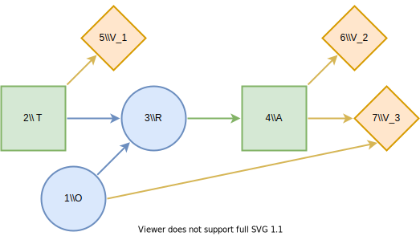

# Used Car Buyer
## Description
To illustrate the basic functionality of Decision Programming, we implement a version of the used car buyer problem in [^1]. In this problem, Joe is buying a used car. The car's price is 1000 USD (US dollars), and its value is 1100 USD. Joe's base profit on the car is thus 100 USD. However, Joe knows that the car is a "lemon", meaning that it has defects in 6 major systems, with a 20% probability. With the remaining 80% probability, the car is a "peach", and it has a defect in only one of the systems.

The repair costs for a peach are only 40 USD, decreasing Joe's profit to 60  USD. However, the costs for a lemon are 200 USD, resulting in a total loss of 100 USD. We can now formulate an influence diagram of Joe's initial problem. We present the influence diagram in the figure below. In an influence diagram, circle nodes such as $O$ are called **chance nodes**, representing uncertainty. Node $O$ is a chance node representing the state of the car, lemon or peach. Square nodes such as $A$ are **decision nodes**, representing decisions. Node $A$ represents the decision to buy or not to buy the car. The diamond-shaped **value node** $V$ denotes the utility calculation in the problem. For Joe, the utility function is the expected monetary value. The arrows or **arcs** show connections between nodes. The two arcs in this diagram point to the value node, meaning that the monetary value depends on the state of the car and the purchase decision.


We can easily determine the optimal strategy for this problem. If Joe decides not to buy the car, his profit is zero. If he buys the car, with 20% probability he loses 100 USD and with an 80% probability he profits 60 USD. Therefore, the expected profit for buying the car is 28 USD, which is higher than the zero profit of not buying. Thus, Joe should buy the car.

We now add two new features to the problem. A stranger approaches Joe and offers to tell Joe whether the car is a lemon or a peach for 25 USD. Additionally, the car dealer offers a guarantee plan which costs 60 USD and covers 50% of the repair costs. Joe notes that this is not a very good deal, and the dealer includes an anti-lemon feature: if the total repair cost exceeds 100 USD, the guarantee will fully cover the repairs.

## Influence diagram


We present the new influence diagram above. The decision node $T$ denotes the decision to accept or decline the stranger's offer, and $R$ is the outcome of the test. We introduce new value nodes $V_1$ and $V_2$ to represent the testing costs and the base profit from purchasing the car. Additionally, the decision node $A$ now can choose to buy with a guarantee.

We start by defining the influence diagram structure. The nodes, as well as their information sets and states, are defined in the first block. Next, the influence diagram parameters consisting of the probabilities and utilities are defined.


```julia
using JuMP, HiGHS
using DecisionProgramming
diagram = InfluenceDiagram()
```

### Car's state

The chance node $O$ is defined by its name, its information set $I(O)$ and its states $lemon$ and $peach$. As seen in the influence diagram, the information set is empty and the node is a root node.

```julia
add_node!(diagram, ChanceNode("O", [], ["lemon", "peach"]))
```

### Stranger's offer decision

A decision node is also defined by its name, its information set and its states.

```julia
add_node!(diagram, DecisionNode("T", [], ["no test", "test"]))
```

### Test's outcome

The second chance node $R$ has nodes $O$ and $T$ in its information set, and three states describing the situations of no test being done, and the test declaring the car to be a lemon or a peach.

```julia
add_node!(diagram, ChanceNode("R", ["O", "T"], ["no test", "lemon", "peach"]))
```

### Purchase decision
The purchase decision represented by node $A$ is added as follows.
```julia
add_node!(diagram, DecisionNode("A", ["R"], ["buy without guarantee", "buy with guarantee", "don't buy"]))
```
### Testing fee, base profit and repair costs

Value nodes are defined by only their names and information sets because they do not have states. Instead, value nodes map their information states to utility values which will be added later on.
```julia
add_node!(diagram, ValueNode("V1", ["T"]))
add_node!(diagram, ValueNode("V2", ["A"]))
add_node!(diagram, ValueNode("V3", ["O", "A"]))
```

### Generate arcs
Now that all of the nodes have been added to our influence diagram we generate the arcs between the nodes. This step automatically orders the nodes, gives them indices and reorganises the information into the appropriate form in the influence diagram structure.
```julia
generate_arcs!(diagram)
```

### Probabilities
We continue by defining probability distributions for each chance node.

Node $O$ is a root node and has two states thus, its probability distribution is simply defined over the two states. We can use the `ProbabilityMatrix` structure in creating the probability matrix easily without having to worry about the matrix dimensions. We then set the probability values and add the probabililty matrix to the influence diagram.
```julia
X_O = ProbabilityMatrix(diagram, "O")
X_O["peach"] = 0.8
X_O["lemon"] = 0.2
add_probabilities!(diagram, "O", X_O)
```

Node $R$ has two nodes in its information set and three states. The probabilities $P(s_j \mid s_{I(j)})$ must thus be defined for all combinations of states in $O$, $T$ and $R$. We declare the probability distribution over the states of node $R$ for each information state in the following way. More information on defining probability matrices can be found on the [usage page](../usage.md).
```julia
X_R = ProbabilityMatrix(diagram, "R")
X_R["lemon", "no test", :] = [1,0,0]
X_R["lemon", "test", :] = [0,1,0]
X_R["peach", "no test", :] = [1,0,0]
X_R["peach", "test", :] = [0,0,1]
add_probabilities!(diagram, "R", X_R)
```


### Utilities
We continue by defining the utilities associated with the information states of the value nodes. The utilities $Y_j(𝐬_{I(j)})$ are defined and added similarly to the probabilities.

Value node $V1$ has only node $T$ in its information set and node $T$ only has two states. Therefore, the utility matrix of node $V1$ should hold utility values corresponding to states $test$ and $no \ test$.

```julia
Y_V1 = UtilityMatrix(diagram, "V1")
Y_V1["test"] = -25
Y_V1["no test"] = 0
add_utilities!(diagram, "V1", Y_V1)
```

We then define the utilities associated with the base profit of the purchase in different scenarios.
```julia
Y_V2 = UtilityMatrix(diagram, "V2")
Y_V2["buy without guarantee"] = 100
Y_V2["buy with guarantee"] = 40
Y_V2["don't buy"] = 0
add_utilities!(diagram, "V2", Y_V2)
```

Finally, we define the utilities corresponding to the repair costs. The rows of the utilities matrix `Y_V3` correspond to the state of the car, while the columns correspond to the decision made in node $A$. Notice that the utility values for the second row are added as a vector, in this case it is important to give the utility values in the correct order. The order of the columns is determined by the order in which the states are given when declaring node $A$. See the [usage page](../usage.md) for more information on the syntax.
```julia
Y_V3 = UtilityMatrix(diagram, "V3")
Y_V3["lemon", "buy without guarantee"] = -200
Y_V3["lemon", "buy with guarantee"] = 0
Y_V3["lemon", "don't buy"] = 0
Y_V3["peach", :] = [-40, -20, 0]
add_utilities!(diagram, "V3", Y_V3)
```

### Generate influence diagram
Finally, generate the full influence diagram before defining the decision model. By default this function uses the default path probabilities and utilities, which are defined as the joint probability of all chance events in the diagram and the sum of utilities in value nodes, respectively. In the [Contingent Portfolio Programming](contingent-portfolio-programming.md) example, we show how to use a user-defined custom path utility function.

```julia
generate_diagram!(diagram)
```

## Decision model
We then construct the decision model by declaring a JuMP model and adding decision variables and path compatibility variables to the model. We define the objective function to be the expected value.

```julia
model = Model()
z = DecisionVariables(model, diagram)
x_s = PathCompatibilityVariables(model, diagram, z)
EV = expected_value(model, diagram, x_s)
@objective(model, Max, EV)
```

Alternatively, RJT formulation can be used by replacing commands on path compatibility variables and objective function creation with commands

```julia
μ_s = RJTVariables(model, diagram, z)
EV = expected_value(model, diagram, μ_s)
@objective(model, Max, EV)
```

and then solving using the solver. Significantly faster solving times are expected using RJT formulation.

We can perform the optimization using an optimizer such as HiGHS.

```julia
optimizer = optimizer_with_attributes(
    () -> HiGHS.Optimizer()
)
set_optimizer(model, optimizer)
optimize!(model)
```


## Analyzing results
Once the model is solved, we extract the results.

```julia
Z = DecisionStrategy(diagram, z)
S_probabilities = StateProbabilities(diagram, Z)
U_distribution = UtilityDistribution(diagram, Z)
```

### Decision strategy

We obtain the following optimal decision strategy:
```julia-repl
julia> print_decision_strategy(diagram, Z, S_probabilities)
┌───────────────┐
│ Decision in T │
├───────────────┤
│ test          │
└───────────────┘
┌───────────────┬───────────────────────┐
│ State(s) of R │ Decision in A         │
├───────────────┼───────────────────────┤
│ lemon         │ buy with guarantee    │
│ peach         │ buy without guarantee │
└───────────────┴───────────────────────┘
```

### Utility distribution
```julia-repl
julia> print_utility_distribution(U_distribution)
┌───────────┬─────────────┐
│   Utility │ Probability │
│   Float64 │     Float64 │
├───────────┼─────────────┤
│ 15.000000 │    0.200000 │
│ 35.000000 │    0.800000 │
└───────────┴─────────────┘
```

From the utility distribution, we can see that Joe's profit with this strategy is 15 USD, with a 20% probability (the car is a lemon) and 35 USD with an 80% probability (the car is a peach).

```julia-repl
julia> print_statistics(U_distribution)
┌──────────┬────────────┐
│     Name │ Statistics │
│   String │    Float64 │
├──────────┼────────────┤
│     Mean │  31.000000 │
│      Std │   8.000000 │
│ Skewness │  -1.500000 │
│ Kurtosis │   0.250000 │
└──────────┴────────────┘
```

The expected profit is thus 31 USD.


## References
[^1]: Howard, R. A. (1977). The used car buyer. Reading in Decision Analysis, 2nd Ed. Stanford Research Institute, Menlo Park, CA.
